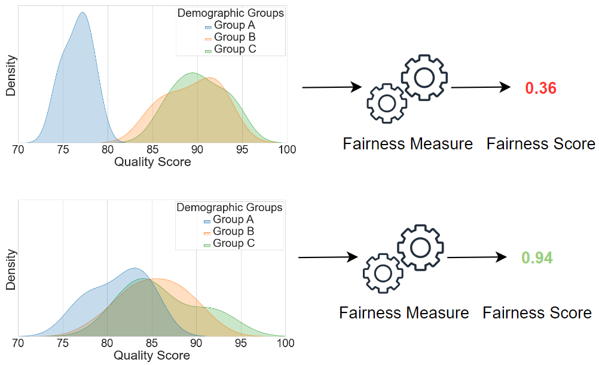

<h1 align="center"> Fairness measures for biometric quality assessment</h1>
<p align="center">

  <p align="center">
   <a href="https://dasec.h-da.de/staff/andre-doersch/"><strong>André Dörsch</strong></a>
   ·
   <a href="https://dasec.h-da.de/staff/torsten-schlett/"><strong>Torsten Schlett</strong></a>
   ·
   <strong>Peter Munch</strong></a>
   ·
   <a href="https://dasec.h-da.de/staff/christian-rathgeb/"><strong>Christian Rathgeb</strong></a>
   ·
   <a href="https://www.ntnu.edu/employees/christoph.busch"><strong>Christoph Busch</strong></a>
  </p>
  
  <h2 align="center">ICPR 2024 - 2nd Workshop on Fairness in Biometric Systems</h2>
  <div align="center">
  </div>

Official repository of the of the [ICPR 2024 - 2nd Workshop on Fairness in Biometric Systems](https://sites.google.com/view/icpr2024-fairbio/home) paper [Fairness measures for biometric quality assessment](https://arxiv.org/pdf/2408.11392)

## Overview

This work proposes multiple fairness measures for evaluating quality components
across demographic groups. This research contributes to the development of fair biometric systems by measuring whether quality components could incorporate demographic variables into their decision.

<p align="center">
  
</p>

## Abstract

Quality assessment algorithms measure the quality of a captured biometric sample. Since the sample quality strongly affects the
recognition performance of a biometric system, it is essential to only
process samples of sufficient quality and discard samples of low-quality.
Even though quality assessment algorithms are not intended to yield
very different quality scores across demographic groups, quality score
discrepancies are possible, resulting in different discard ratios. To ensure
that quality assessment algorithms do not take demographic characteristics into account when assessing sample quality and consequently to
ensure that the quality algorithms perform equally for all individuals,
it is crucial to develop a fairness measure. In this work we propose and
compare multiple fairness measures for evaluating quality components
across demographic groups. Proposed measures, could be used as potential candidates for an upcoming standard in this important field.

## Setup

### Requirements

Ensure you have Python >= 3.8.6 installed on your system.

### Package installation

To install the necessary dependencies for the usage of proposed fairness measures, run the following command in your terminal:

```
   pip install numpy=1.23.4
```

If you are interested in re-running the experiments from the paper in the provided jupyter-notebook, you will need to install additional packages:

```
   pip install pandas=1.1.5, seaborn=0.11.1, matplotlib=3.3.3
```

## Usage

### 1. Clone this repository

```
   git clone https://github.com/dasec/QA-Fairness-Measures.git
```

### 2. Use the fairness measures as demonstrated in the examples

#### Example of calculating the Mean-GC-SQFR and Mean-GC-CSQFR

```
# Imports
from src.fairness_measures.fairness_measure_gc import gini_coefficient

# Example: Mean Quality Scores from three different demographic groups
Mean_QS_Group_A, Mean_QS_Group_B, Mean_QS_Group_C = 35, 95, 89

# Calculate the Gini Coefficient
gini_score = gini_coefficient([35, 95, 89])
# Output: 0.273972602739726

# Calculate the Mean-GC-SQFR
Mean_GC_SQFR = 1 - gini_score
# Output: 0.726027397260274

# Calculate the Mean-GC-CSQFR
Mean_GC_CSQFR = (1 - gini_value) ** 3
# Output: 0.38270049894991737
```

#### Example of calculating the LWM-GC-SQFR and LWM-GC-CSQFR

```
# Imports
from src.fairness_measures.fairness_measure_gc import gini_coefficient
from src.fairness_measures.fairness_measure_lwm import low_weighted_mean_score

# Example: Quality Scores from two different demographic groups
Qd1, Qd2 = [1,2,3], [4,5,6]
QD = np.concatenate([Qd1,Qd2])

LWM_D1 = low_weighted_mean_score([Qd1, QD])
# Output: 1.8333333333333335

LWM_D2 = low_weighted_mean_score([Qd2, QD])
# Output: 4.333333333333333

LWM_GC_SQFR = 1 - gini_coefficient([LWM_D1, LWM_D2])
# Output: 0.5945945945945946

LWM_GC_CSQFR = (1 - gini_coefficient([LWM_D1, LWM_D2])**3)
# Output: 0.21021459735
```

#### Example of calculating the MDG-SQFR

```
# Imports
from src.fairness_measures.fairness_measure_mdg import mean_discard_gap

# Example: Quality Scores from three different demographic groups
group_a = np.array([76, 76, 77, 77, 78, 79, 80, 82, 82, 84])
group_b = np.array([84, 84, 84, 84, 85, 85, 87, 87, 88, 88])
group_c = np.array([82, 82, 82, 84, 84, 86, 87, 87, 88, 88])

groups = [group_a, group_b, group_c]

MGD_SQFR = 1 - mean_discard_gap(groups)
# Output: 0.44999999999999996
```

## Citation

If you use this repository and found it useful for your research, please consider citing this paper:

```
@misc{Dörsch-FairnessMeasures-2024,
      title={Fairness measures for biometric quality assessment}, 
      author={A. Dörsch and T. Schlett and P. Munch and C. Rathgeb and C.Busch},
      year={2024},
      eprint={2408.11392},
      archivePrefix={arXiv},
      primaryClass={cs.CV},
      url={https://arxiv.org/abs/2408.11392}, 
}
```
